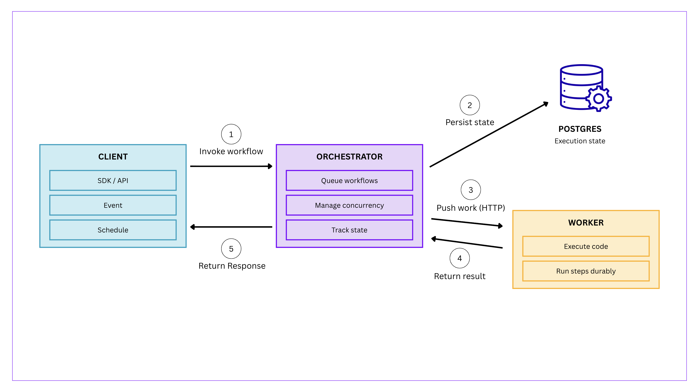
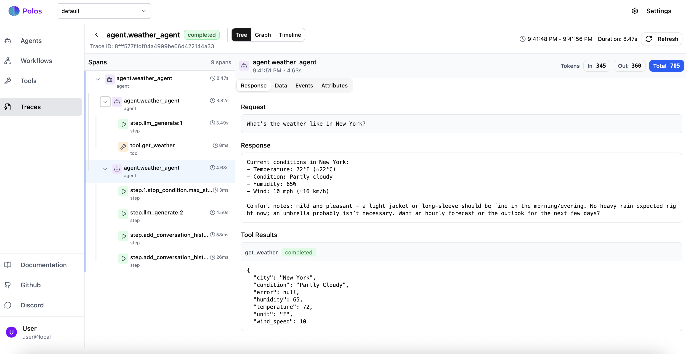

<p align="center">
  
</p>

<p align="center">
  <strong>Durable execution platform for AI agents</strong>
</p>

<p align="center">
  <a href="https://github.com/polos-dev/polos">
    
  </a>
  <a href="https://docs.polos.dev">
    
  </a>
  <a href="https://discord.gg/ZAxHKMPwFG">
    
  </a>
</p>

<p align="center">
  AI agents that survive crashes, resume mid-execution, and pause for human approval - with zero manual checkpointing, retry logic, or queue management.
</p>

<p align="center">
  <b>⭐ Star us to support the project!</b>
</p>

---

Polos is a durable execution platform for AI agents. It provides the stateful infrastructure required to run long-running, autonomous agents reliably at scale, including a **built-in event system** for agent coordination, so you don't need to bolt on Kafka or RabbitMQ.

Write it all in plain Python (or TypeScript - coming soon). No DAGs to define, no graph syntax to learn. Use loops, conditionals, and function calls naturally while Polos handles durability, reliability and scaling automatically.

```python
from polos import Agent, workflow, WorkflowContext

order_agent = Agent(
    provider="openai",
    model="gpt-4o",
    tools=[check_inventory, calculate_shipping]
)

@workflow(trigger_on_event="order/new")
async def process_order(ctx: WorkflowContext, order: ProcessOrderInput):
    # Agent validates order and checks inventory
    validation = await ctx.step.agent_invoke_and_wait(
        "validate_order",
        order_agent.with_input(f"Validate this order: {order}")
    )

    if not validation.result.valid:
        return ProcessOrderOutput(status="invalid", reason=validation.result.reason)

    # High-value orders need approval - suspend until human decides
    if order.amount > 1000:
        decision = await ctx.step.suspend(
            "approval",
            data={"id": order.id, "amount": order.amount, "items": order.items}
        )
        if not decision.data["approved"]:
            return ProcessOrderOutput(status="rejected")

    # Charge customer (exactly-once guarantee)
    payment = await ctx.step.run("charge", charge_stripe, order)

    # Wait for warehouse pickup (could be hours or days)
    await ctx.step.wait_for_event("wait_pickup", topic=f"warehouse.pickup/{order.id}")

    # Send shipping notification
    await ctx.step.run("notify", send_shipping_email, order)

    return ProcessOrderOutput(status="completed", payment_id=payment.id)
```

This workflow survives crashes, resumes mid-execution, and pauses for approval - automatically.

---

## Architecture

<p align="center">
  
</p>

Polos consists of three components:

- **Orchestrator**: Manages execution state, handles retries, and coordinates workers
- **Worker**: Runs your agents and workflows, connects to the orchestrator
- **SDK**: Python library for defining agents, workflows, and tools

---

## See It In Action

Imagine a workflow that charges a customer, then pauses for a human fraud review. In most frameworks, a server restart during that 24-hour wait would lose the state - or worse, re-run the charge on reboot. Polos guarantees exactly-once durable execution.

<br />

<p align="center">
  <video src="https://github.com/user-attachments/assets/4607d70e-b078-4b8e-ad2e-a28bd1820a3f" width="800" controls></video>
</p>

**Timeline of what's happening:**

1. `charge_stripe` runs → Polos checkpoints the execution result

2. Workflow suspends for fraud review → Worker resources freed

3. Worker 1 crashes during the wait

4. Fraud team approves → Signal sent to orchestrator

5. Worker 2 resumes on a different machine → Stripe is **not** called again, result replayed from the log guaranteeing exactly-once execution

6. Confirmation email sent → workflow completes

Polos handles failures, rescheduling, and checkpointing. You just focus on business logic.

---

## Why Polos?

| Feature | Description |
|---------|-------------|
| **🧠 Durable State** | Your agent survives crashes with call stack and local variables intact. Step 18 of 20 fails? Resume from step 18. No wasted LLM calls. |
| **🚦 Global Concurrency** | System-wide rate limiting with queues and concurrency keys. Prevent one rogue agent from exhausting your entire OpenAI quota. |
| **🤝 Human-in-the-Loop** | Native support for pausing execution. Wait hours or days for user approval and resume with full context. Paused agents consume zero compute. |
| **📡 Agent Handoffs** | Transactional memory for multi-agent systems. Pass reasoning history between specialized agents without context drift. |
| **🔍 Decision-Level Observability** | Trace the reasoning behind every tool call, not just raw logs. See why your agent chose Tool B over Tool A. |
| **⚡ Production Ready** | Automatic retries, exactly-once execution guarantees, OpenTelemetry tracing built-in. |

<br />

### Logic Belongs in Code, Not Configs

**With Polos:**
```python
@workflow
async def process_order(ctx: WorkflowContext, order: ProcessOrderInput):
    if order.amount > 1000:
        approved = await ctx.step.suspend("approval", data=order.model_dump())
        if not approved.data["ok"]:
            return {"status": "rejected"}

    await ctx.step.run("charge", charge_stripe, order)
    await ctx.step.run("notify", send_email, order)
```

**Other platforms:**
```python
dag = DAG(
    nodes=[
        Node("check_amount", CheckAmount),
        Node("approval", HumanApproval),
        Node("charge", ChargeStripe),
        Node("notify", SendEmail),
    ],
    edges=[
        ("check_amount", "approval", condition="amount > 1000"),
        ("check_amount", "charge", condition="amount <= 1000"),
        ("approval", "charge", condition="approved"),
        ("charge", "notify"),
    ]
)
```

No DAGs. No graph syntax. Just Python.

---

## Quick Start

### 1. Install Polos Server

```bash
curl -fsSL https://install.polos.dev/install.sh | bash
polos-server start
```

Copy the project ID displayed when you start the server. You'll need it in the next steps.

### 2. Install the SDK

```bash
pip install polos-sdk
```

### 3. Create your first agent

```python
# worker.py
from polos import Agent, Worker, PolosClient

weather_agent = Agent(
    id="weather_agent",
    provider="openai",
    model="gpt-4o-mini",
    system_prompt="You are a helpful weather assistant.",
    tools=[get_weather],
)

client = PolosClient(project_id="your-project-id")
worker = Worker(client=client, agents=[weather_agent])

if __name__ == "__main__":
    import asyncio
    asyncio.run(worker.run())
```

### 4. Run your agent

```bash
# Terminal 1: Start the worker
python worker.py

# Terminal 2: Invoke the agent
python main.py
```

### 5. See it in action

Open the Polos UI to see your agent's execution trace, tool calls, and reasoning:

<p align="center">
  
</p>

📖 **[Full Quick Start Guide →](https://docs.polos.dev/quickstart)**

---

## Examples

### Agents

| Example | Description |
|---------|-------------|
| [Agent with tools](./python-examples/01-agent-with-tools) | Simple agent with tool calling |
| [Structured Output](./python-examples/02-structured-output) | Agent with Pydantic model responses |
| [Streaming](./python-examples/03-agent-streaming) | Real-time streaming responses |
| [Conversational Chat](./python-examples/04-conversational-chat) | Multi-turn conversations with memory |
| [Thinking Agent](./python-examples/05-thinking-agent) | Chain-of-thought reasoning |
| [Guardrails](./python-examples/06-guardrails) | Input/output validation |
| [Multi-Agent Coordination](./python-examples/14-router-coordinator) | Workflow orchestrating multiple agents |

### Workflows

| Example | Description |
|---------|-------------|
| [Workflow Basics](./python-examples/08-workflow-basics) | Core workflow patterns |
| [Suspend/Resume](./python-examples/09-suspend-resume) | Human-in-the-loop approvals |
| [State Persistence](./python-examples/10-state-persistence) | Durable state across executions |
| [Error Handling](./python-examples/11-error-handling) | Retry, fallback, compensation patterns |
| [Queues & Concurrency](./python-examples/12-shared-queues) | Rate limiting and concurrency control |
| [Parallel Execution](./python-examples/13-parallel-review) | Fan-out/fan-in patterns |

### Events & Scheduling

| Example | Description |
|---------|-------------|
| [Event-Triggered](./python-examples/15-event-triggered) | Pub/sub event-driven workflows |
| [Scheduled Workflows](./python-examples/16-scheduled-workflow) | Cron-based scheduling |

---

## Under the Hood

Polos captures the result of every side effect - tool calls, API responses, time delays as a durable log.
If your process dies, Polos replays the workflow from the log, returning previously-recorded results instead of re-executing them.
Your agent’s exact local variables and call stack are restored in milliseconds.

**Completed steps are never re-executed - so you never pay for an LLM call twice.**

---

## Documentation

For detailed documentation, visit **[docs.polos.dev](https://docs.polos.dev)**

- 📖 [Quick Start Guide](https://docs.polos.dev/quickstart)
- 🤖 [Building Agents](https://docs.polos.dev/agents/overview)
- ⚙️ [Workflow Patterns](https://docs.polos.dev/workflows/overview)
- 📡 [Events](https://docs.polos.dev/workflows/event-triggered-workflows)
- ⏰ [Scheduling](https://docs.polos.dev/workflows/scheduled-workflows)
- 🔍 [Observability](https://docs.polos.dev/observability/tracing)

---

## Community

Join our community to get help, share ideas, and stay updated:

- ⭐ [Star us on GitHub](https://github.com/polos-dev/polos)
- 💬 [Join our Discord](https://discord.gg/ZAxHKMPwFG)
- 📖 [Read the Docs](https://docs.polos.dev)

---

## Contributing

We welcome contributions! Whether it's bug reports, feature requests, documentation improvements, or code contributions.

- 🐛 [Report Issues](https://github.com/polos-dev/polos/issues)
- 💡 [Feature Requests](https://github.com/polos-dev/polos/issues)
- 📖 [Contributing Guide](CONTRIBUTING.md)

---

## License

Polos is [Apache 2.0 licensed](LICENSE).
